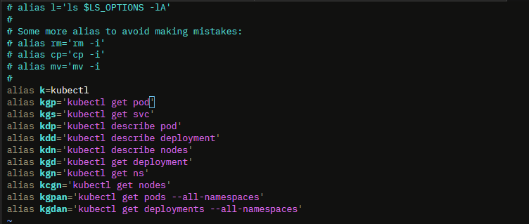

<p align="center">
  
</p>

# CKAD: Certified Kubernetes Application Developer
Mempelajari pehamahan tentang cara menghadapi ujian CKAD. Pertanyaan berbasis skenario yang dirancang sedemikan rupa agar realistis dan mirip dengan situasi dunia nyata, guna mempercepat tujuan menjadi profesional Certified Kubernetes Application Developer. Materi saya ambil dari mempelajari course di Udemy.

## Shortcut 
Gunakan shorcut untuk beberapa command di kubernetes, memudahkan dalam konfigurasi dan meminimalisir kesalahan typo dalam memasukan command. karena ketika ada kesalahan dalam memasukan command itu sangat krusial saat ujian CKAD bisa mengurangi poin. berikut list shorcut yang aku digunakan
```bash
alias k=kubectl
alias kgp='kubectl get pod'
alias kgs='kubectl get svc'
alias kdp='kubectl describe pod'
alias kdd='kubectl describe deployment'
alias kdn='kubectl describe nodes'
alias kgd='kubectl get deployment'
alias kgn='kubectl get ns'
alias kcgn='kubectl get nodes'
alias kgpan='kubectl get pods --all-namespaces'
alias kgdan='kubectl get deployments --all-namespaces'
```

## Membuat alias permanen

1. Masuk ke direktori root lalu edit bashrc nya
```bash
vi /root/.bashrc
```

2. Paste alias di atas, di dalam file `.bashrc`. example :


3. Aktifkan perubahan bashrc
```bash
source /root/.bashrc
```

4. Kalau untuk user biasa juga bisa di setting, karena di atas hanya khusus untuk root user. example :
```bash
vi /home/rouf/.bashrc
```
note: jika sudah di paste silahkan di aktifnya dengan command berikut:
```bash
source ~/.bashrc
```
